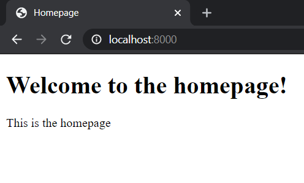

# Django Quickstart Guide

## Install Django

### Virtual Environment

It's a good idea to work in a virtual environment:

```
$ python -m venv env
source env/Script/activate
```

### Install with pip

```
$ pip install django
```

## Setup Django project

### Start new project

Start Django project:

```
$ django-admin startproject my_project
```

Run Django server:

```
$ python manage.py runserver
```

Django project will be live on `localhost:8000`. Django already creates an admin page in `localhost:8000/admin`.

### Change time zone

Open `my_project/settings.py` and add the appropriate time zone to the `TIME_ZONE` variable:

```python
TIME_ZONE = 'America/Toronto'
```

Look up [tz database time zones.](https://en.wikipedia.org/wiki/List_of_tz_database_time_zones)

## Setup Django application

### Start new app

Django can have multiple applications running under a single project. Start a new Django application within your project:

```
$ python manage.py startapp my_app
```

This creates a `my_app` directory.

### Add path to app

Open `my_app/apps.py`:

```python
from django.apps import AppConfig

class MyAppConfig(AppConfig):
    name = 'my_app'
```

Copy the class name, i.e. "`MyAppConfig`", and paste it in the `INSTALLED_APPS` list in `my_project/settings.py` as "`my_app.apps.MyAppConfig`":

```python
...
INSTALLED_APPS = [
    'my_app.apps.MyAppConfig',
    'django.contrib.admin',
    'django.contrib.auth',
    'django.contrib.contenttypes',
    'django.contrib.sessions',
    'django.contrib.messages',
    'django.contrib.staticfiles',
]
...
```

## Creating a basic home page

### HTML template

Within the `my_app` directory, create `templates/my_app/home.html`:

```html
<!DOCTYPE html>
<html lang="en">
<head>
    <meta charset="utf-8">
    <title>Homepage</title>
</head>
<body>
    <h1>Welcome to the homepage!</h1>
    <p>This is the homepage</p>
</body>
</html>
```

### Views

Open `my_app/views.py` and edit it to add your a view to the home page:

```python
from django.shortcuts import render

def home(request):
    return render(request, 'my_app/home.html')
```

### URLs

Open `my_project/urls.py` and edit it to add a URL path to `my_app`:

```python
from django.contrib import admin
from django.urls import path, include

urlpatterns = [
    path('admin/', admin.site.urls),
    path('', include('my_app.urls'))
]
```

Open `my_app/urls.py` (create it if it doesn't exist) and edit it to add a URL path to the home view:

```python
from django.urls import path
from . import views

urlpatterns = [
    path('', views.home, name = 'my_app-home')
]
```

Now `localhost:8000` should show `home.html`:



## Passing data from Django to HTML templates

Data can be passed from views.py to the HTML templates using the [Jinja2](https://jinja.palletsprojects.com/en/2.11.x/) syntax.

`views.py`:

```python
from django.shortcuts import render

def home(request):
    data = [
        {
            'name' : 'Alice',
            'email' : 'alice@gmail.com',
        },
        {
            'name' : 'Bob',
            'email' : 'bob@gmail.com'
        },
        {
            'name' : 'Charlie',
            'email' : 'charlie@gmail.com'
        }
    ]

    context = {
        "data" : data
    }
    return render(request, 'my_app/home.html', context)
```

`home.html`:

```html
<!DOCTYPE html>
<html lang="en">
<head>
    <meta charset="utf-8">
    <title>Homepage</title>
</head>
<body>
    <h1>Welcome to the homepage!</h1>
    <p>This is the homepage</p>
    
        <p>Name: {{ entry.name }}</p>
        <p>Email: {{ entry.email }}</p>
    
</body>
</html>
```

Now `localhost:8000` should display the data passed:


## Admin page

### Apply migrations

Create new migrations based on the current changes made to the models:

```
$ python manage.py makemigrations
```

Apply migrations:

```
$ python manage.py migrate
```

### Create new user

Create new user and enter username, email and password:

```
$ python manage.py createsuperuser
Username (leave blank to use 'user'): alvii147
Email address: alvii147@gmail.com
Password: 
Password (again):
Superuser created successfully.
```

### Manage users

Login to admin at `http://localhost:8000/admin/`:


View and change user information:


## Database Management

Open `my_app/models.py` and edit it to add a model:

```python
from django.db import models
from django.utils import timezone
from django.contrib.auth.models import User

class Posting(models.Model):
	title = models.CharField(max_length=100)
	content = models.TextField()
	date_posted = models.DateTimeField(default=timezone.now)
	author = models.ForeignKey(User, on_delete=models.CASCADE)
```

After that, create and apply migrations:

```
python manage.py makemigrations
python manage.py migrate
```

### Database queries

```python
from my_app.models import Posting
from django.contrib.auth.models import User

# Get all users
users = User.objects.all()

# Get first user
user = User.objects.first()

# Filter user by username
user = User.objects.filter(username = 'alvii147').first()

# Get id of user
user.id
user.pk

# Get user by id
User.objects.get(id=1)

# Create new posting by user
posting = Posting(title='Posting 1', content='Posting 1 content', author=user)
posting.save()

# Create new posting by user id
posting = Posting(title='Posting 2', content='Posting 2 content', author_id=user.id)
posting.save()

# Get postings by user
user.posting_set.all()

# Create new posting for user
user.posting_set.create(title='Posting 3', content='Posting 3 content')
```


