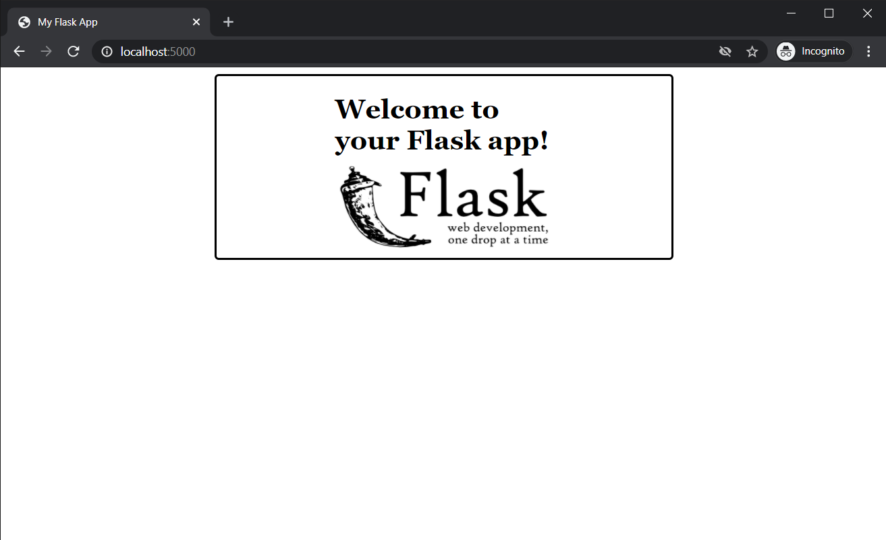
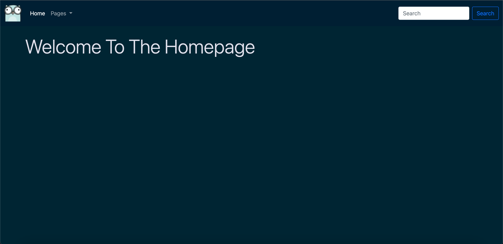
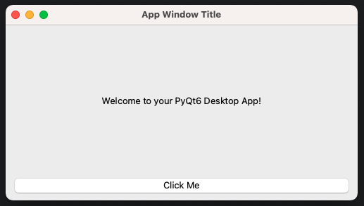

# Boilerplate code generator

**REPOSITORY UNDER CONSTRUCTION**

`createboilerplate.sh` is a bash script for generating boilerplate code for projects based on specific libraries and frameworks. It's intended to help kickstart projects by laying out the empty templates and take over the repetitive task of setting initial configurations.

## Supported Libraries & Frameworks

- [Django](#django)
- [Go (Web Server)](#go)
- [Flask](#flask)
- [PyQt6](#pyqt6)

## Getting Started

Clone the repository to your local environment.

```bash
git clone https://github.com/alvii147/Boilerplate.git
```

It's convenient to set up an alias for the path to this script so it can be called from anywhere. Add the following line to `.bashrc` or `.bashprofile` to set up a permanent alias.

```bash
alias createboilerplate="/absolute/path/to/./createboilerplate.sh"
```

There are some dependencies within the individual projects, all of which are explored below.

## Django

<p align="center"></p>

### Usage

```
createboilerplate [OPTIONS] django
```

### Options

```
-p = project name
```

### Requirements

Install Django, Django REST Framework, and Django CORS Headers.

```bash
pip3 install django djangorestframework django-cors-headers
```

### Example Use

```
createboilerplate -p MyProject django
```

This creates a [Django](https://www.djangoproject.com/) project and application. The application includes development and production settings, and an `accounts` app with a custom user model.

```
MyProject/
├── MyProject
│   ├── __init__.py
│   ├── asgi.py
│   ├── settings
│   │   ├── __init__.py
│   │   ├── base.py
│   │   ├── dev.py
│   │   └── prod.py
│   ├── urls.py
│   └── wsgi.py
├── accounts
│   ├── __init__.py
│   ├── admin.py
│   ├── apps.py
│   ├── migrations
│   │   └── __init__.py
│   ├── models.py
│   ├── tests.py
│   └── views.py
└── manage.py
```

To start using the application, set the appropriate environment variables.

```bash
# development/production environment
export MYPROJECT_DJANGO_ENV="development"
# postgres settings
export MYPROJECT_POSTGRES_DB="<postgresql database name>"
export MYPROJECT_POSTGRES_USER="<postgresql username>"
export MYPROJECT_POSTGRES_PASSWORD="<postgres password>"
export MYPROJECT_POSTGRES_HOST="<postgres host name>"
export MYPROJECT_POSTGRES_PORT="<postgres port number>"
# email backend settings (only for production)
export MYPROJECT_EMAIL_HOST_USER="<postgres host name>"
export MYPROJECT_EMAIL_HOST_PASSWORD="<postgres port number>"
```

Once environment variables are set, Django server is ready to be run.

```bash
python3 manage.py runserver
```

In order to create and apply initial migrations (include those of the custom user), run migrations command.

```bash
python3 manage.py makemigrations
python3 manage.py migrate
```

## Flask

<p align="center"></p>

### Usage

```
createboilerplate [OPTIONS] flask
```

### Options

```
-p = project name
```

### Requirements

Install Flask and Flask SQLAlchemy.

```bash
pip3 install Flask Flask-SQLAlchemy
```

Install Flask SQLAlchemy (optional, required for setup database option).

```
pip install flask-sqlalchemy
```

### Example Use

```
createboilerplate -p MyProject flask
```

This creates a boilerplate Python [Flask](https://flask.palletsprojects.com/) application, with an HTML template, a CSS file and a SQLite3 database.

```
MyProject/
├── MyProject.py
├── static
│   └── styles.css
└── templates
    └── home.html
```

Set up environment variables.

```bash
export FLASK_APP_SECRET_KEY="thequickbrownfoxjumpedoverthelazydog" 
```

Executing `MyProject.py` runs the basic Flask application on `https://localhost:5000`.

```bash
python3 MyProject.py
```



## Go

<p align="center"></p>

### Usage

```
createboilerplate [OPTIONS] go
```

### Options

```
-p = project name
-u = github username
```

### Requirements

Install Go from the [official Go website](https://go.dev/)

### Example Use

```
createboilerplate -p MyProject -u Noobmaster69 go
```

This generates a boilerplate Go server that serves HTML templates using [Go's built-in templating library](https://pkg.go.dev/html/template), styled with [Bootstrap](https://getbootstrap.com/). A `Dockerfile` is also generated to build and run the application inside a [Docker](https://www.docker.com/) container.

```
MyProject/
├── Dockerfile
├── go.mod
├── handlers
│   ├── home.go
│   ├── logging.go
│   └── templates.go
├── main.go
├── static
│   ├── css
│   │   └── styles.css
│   ├── images
│   │   └── gopher.png
│   └── js
│       └── index.js
└── templates
    ├── head.html
    ├── home.html
    ├── navbar.html
    └── scripts.html
```

Execute the go module to run the web server on `https://localhost:8000`.

```bash
go run .
```



## PyQt6

<p align="center"></p>

### Usage

```
createboilerplate [OPTIONS] pyqt6
```

### Options

```
-p = project name
```

### Requirements

Install PyQt6.

```
pip install pyqt6
```

### Example Use

```
createboilerplate -p MyProject pyqt6
```

This creates a boilerplate [PyQt5](https://riverbankcomputing.com/software/pyqt/intro) script, `MyProject.py`. Running it starts a basic PyQt6 desktop application.

```
python3 MyProject.py
```

