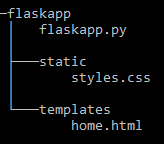
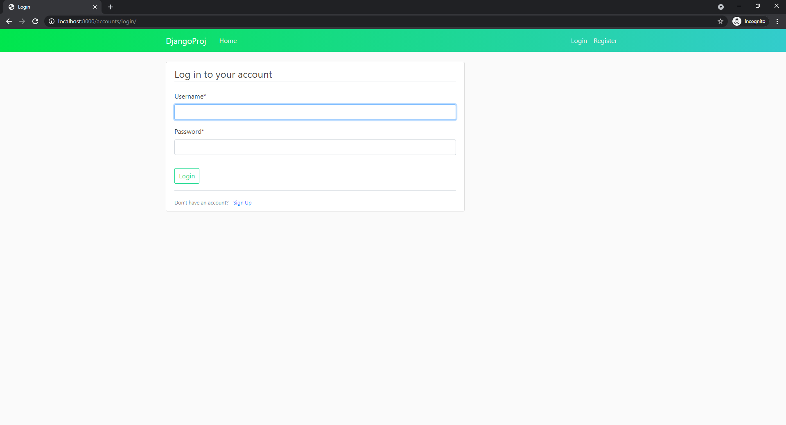

# Boilerplate code generator

`createboilerplate.sh` is a bash script for generating boilerplate code for projects based on specific libraries and frameworks. It's intended to help kickstart projects by laying out the empty templates and take over the repetitive task of setting initial configurations.

## Setting up an alias

It's convenient to set up an alias for the path to this script so it can be called from anywhere.

```
alias createboilerplate="/absolute/path/to/./createboilerplate.sh"
```

## Flask


### Usage

```
createboilerplate [OPTIONS] flask
```

### Options

```
-a = app name
-d,  setup SQLite3 database
```

### Requirements

Install Flask

```
pip install flask
```

Install Flask SQLAlchemy (Only required for setup database option)

```
pip install flask-sqlalchemy
```

### Example Use

```
createboilerplate -d -a flaskapp flask
```

This creates a boilerplate Python **Flask** application, with an HTML template, a CSS file and a SQLite3 database.



Executing `flaskapp.py` runs the basic Flask application on `https://localhost:5000`.

```
python3 flaskapp.py
```


## Django


### Usage

```
createboilerplate [OPTIONS] django
```

### Options

```
-p = project name
-a = app name
-R,  setup Django REST framework
-r,  setup ReactJS integration
-t = time zone
```

### Dependencies

Install Django

```
pip install django
```

Install Django Crispy Forms

```
pip install django-crispy-forms
```

Install Django REST framework (optional, but required for REST framework option)

```
pip install djangorestframework
```


### Example Use

```
createboilerplate -p django_proj -a django_app -R -t EST django
```

This creates a **Django** project and application. The application includes user registration and login pages, rendered with Bootstrap 4 HTML templates. The REST framework option also sets up a REST API that allows CRUD operations.


The Django server can then be run on `https://localhost:8000`.

```
python manage.py runserver
```

Home page at `https://localhost:8000/`:


Login page at `https://localhost:8000/accounts/login/`:



Register page at `https://localhost:8000/accounts/register/`:


Browsable REST API at `https://localhost:8000/api/users/`:


### React.JS Integration


`createboilerplate.sh` also supports Django and [React.JS](https://reactjs.org/) integration using webpack, babel and the Django REST framework. This can be done using the **-r** option. Running it with the React.JS option sets up the project to render the home page using a React component instead of an HTML template (login and register pages are still rendered using HTML templates and crispy forms).

Running the React.JS option creates a `frontend` Django application which includes all React components and dependencies:


This also creates a `launch.sh`, intended to be used as a shortcut to run both the Django application and the webpack dev server. Executing `launch.sh` should run the server with the same application as the one without the React.JS option at `https://localhost:8000`.

## PyQt5


### Usage

```
createboilerplate [OPTIONS] pyqt5
```

### Options

```
-a = app name
```

### Requirements

Install PyQt5

```
pip install pyqt5
```

### Example Use

```
createboilerplate -a pyqt5app pyqt5
```

This creates a boilerplate **PyQt5** script, `pyqt5app.py`. Running it starts a basic PyQt5 desktop application.

```
python3 pyqt5app.py
```


