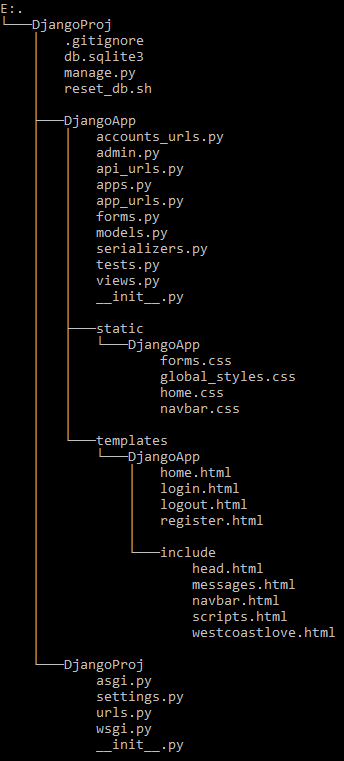
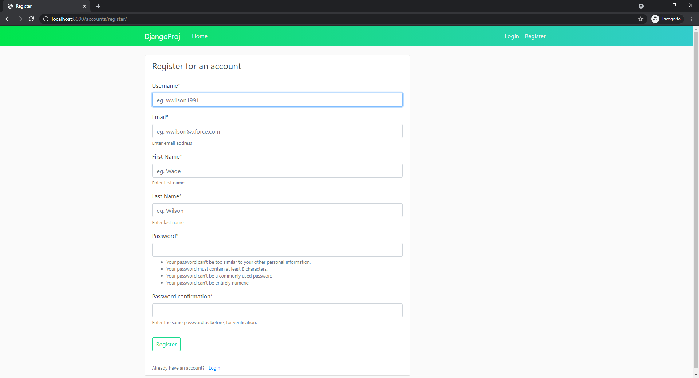

# Boilerplate code generator

`createboilerplate.sh` is a bash script for generating boilerplate code for basic libraries and frameworks.

## Setting up an alias

It's convenient to set up an alias for the path to this script so it can be called from anywhere.

```
alias createboilerplate="/absolute/path/to/./createboilerplate.sh"
```

## Flask

### Usage

```
createboilerplate [OPTIONS] flask
```

### Options

**-a** = app name

**-d,** setup SQLite3 database

### Requirements

Install Flask

```
pip install flask
```

Install Flask SQLAlchemy (Only required for setup database option)

```
pip install flask-sqlalchemy
```

### Example Use

```
createboilerplate -d -a flaskapp flask
```

This creates a boilerplate Python **Flask** application, with an HTML template, a CSS file and a SQLite3 database.


Executing `flaskapp.py` runs the basic Flask application on `localhost:5000`.

```
python3 flaskapp.py
```


## Django

### Usage

```
createboilerplate [OPTIONS] django
```

### Options

**-p** = project name

**-a** = app name

**-t** = time zone

### Dependencies

Install Django

```
pip install django
```

Install Django Crispy Forms

```
pip install django-crispy-forms
```

### Example Use

```
createboilerplate -p django_proj -a django_app -t EST django
```

This creates a **Django** project, sets up a Django application, user registration, user login, and bootstrap HTML templates.



The Django server can then be run on `localhost:8000`.

```
python manage.py runserver
```

#### Homepage


#### Register Page



## PyQt5

### Usage

```
createboilerplate [OPTIONS] pyqt5
```

### Options

**-a** = app name

### Requirements

Install PyQt5

```
pip install pyqt5
```

### Example Use

```
createboilerplate -a pyqt5app pyqt5
```

This creates a boilerplate **PyQt5** script, `pyqt5app.py`. Running it starts a basic PyQt5 desktop application.

```
python3 pyqt5app.py
```


